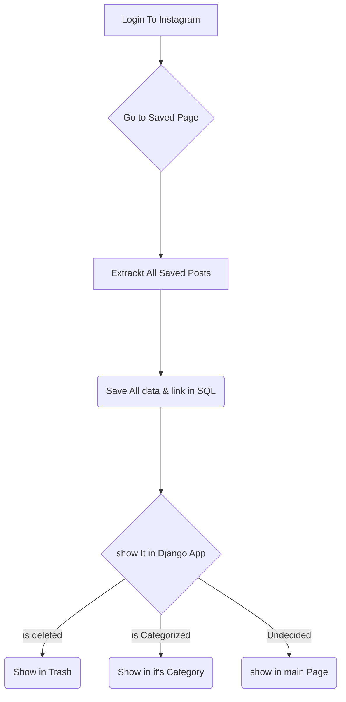

# Instagram-Saved
This Project scrap the instagram's Saved  Post.

# Project Structure

```mermaid
flowchart TD
    A[Login To Instagram] --> B{Go to Saved Page}
    B ----> C[Extrackt All Saved Posts]
    C ----> D(Save All data & link in SQL)
    D ----> E{show It in Django App}
    E --> |is deleted| F(Show in Trash)
    E --> | is Categorized| G(Show in it's Category)
    E --> |Undecided| H(show in main Page)
```